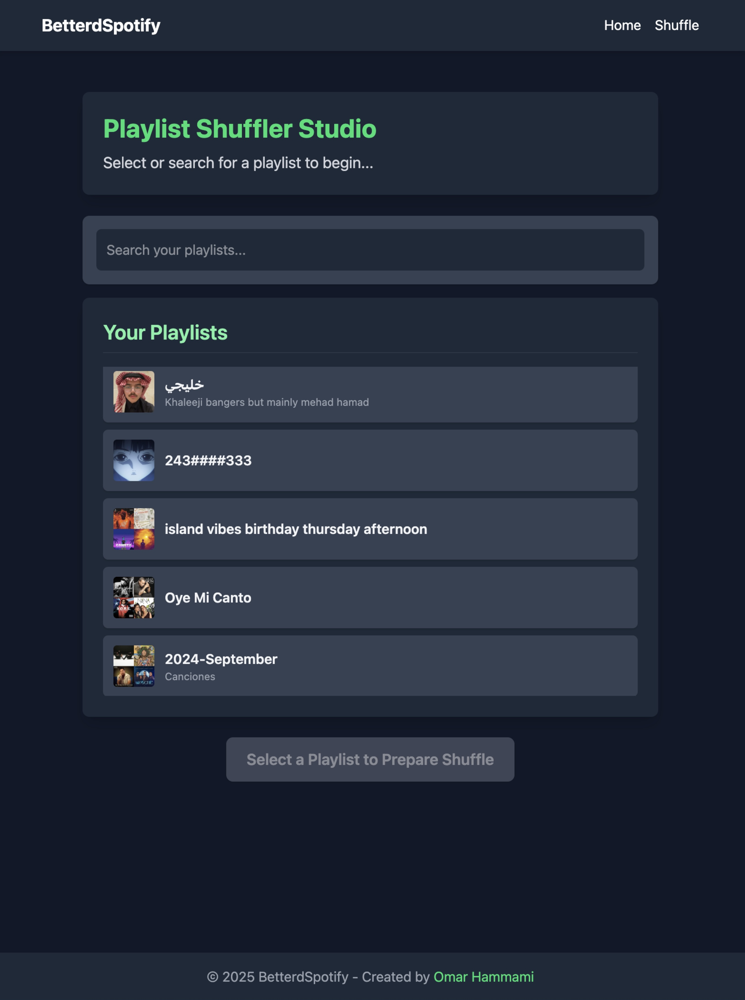

# Betterd Spotify 🎵

A fullstack Rust web application that provides **true random shuffling** for Spotify playlists – because Spotify's "shuffle" isn't really random.

Currently working on a graphdb neurosymbolic playlist unraveler. Basically, I want to make playlists based off my music library or a seldction of playlists, based off "Concepts" such as genre, language, or whatever. Im not happy with how spotify manages my music, in that I cant just like get all of my saved Reggaeton songs in a single playlist, or all of my amapiano songs in a single playlist. Their whole AI system of making playlists focuses on what youre currently listening to, and puts new songs-- not valuing your current music library at all. 

## Current Work

 - neo4j DB with multi user support and song library (Done)
 - Multi user site support (Done)
 - LLM feature extraction for tracks 
 - Symbolic reasoning for playlist creation

At first, I wanted to do this in a "seed and expand" system, where:
 - I obtain hard features for tracks, such as bpm, energy, time sig, speechiness, via spotify API
 - "Seed" a concept, by giving an llm a track that represents a concept. LLM gives me rules that could define what tracks fit the concept. 
 - Perform graph optimized creation of giving other tracks that fit the rule, the concept.
 - Get playlist

However, turns out that the spotify music features api is deprecated. 
 - Now exploring getting track features via LLM, in large batches. 
 - Features: genre, influence, country of origin, beat type, rthyhmn pattern, vocal style, theme
 - 
In testing, this approach gives me good features for even new songs. However, still doing work on how to do symbolic reasoning, as the whole point is that
I do not want to rely on LLMs for music information that much -- want minimal and strong features given to tracks from an LLM, and the creation of new symbols via reasoning. 
I dont want to waste money on enormous amounts of LLM calls to give my graphs new information.


--- 

## Why This Exists

This project was born out of two motivations:
1. **Learning Rust**: I wanted to practice Rust and build my first fullstack application with it
2. **Fixing Spotify's Shuffle**: Spotify's shuffle algorithm is frustratingly biased toward "favorite" tracks, playing the same songs repeatedly instead of giving you a genuine random experience from your entire playlist

## The Problem with Spotify's Shuffle

Spotify uses a weighted algorithm that prioritizes songs it thinks you want to hear based on your listening history. While this might sound good in theory, it means:
- Large playlists effectively become small playlists of the same 50-100 songs
- You never discover forgotten gems in your own playlists
- The "shuffle" experience becomes predictable and boring

## Current Features ✅

### True Random Shuffle
- Creates a genuinely randomized copy of any Spotify playlist
- Preserves the original playlist (creates a new one with "_TRUE SHUFFLED_" suffix)
- Maintains playlist cover art
- Handles playlists of any size with batch processing

### User Experience
- OAuth 2.0 authentication with Spotify
- Clean, responsive UI built with TailwindCSS
- Real-time progress tracking during shuffle operations
- Search and filter through your playlists
- Profile display with user information

## Tech Stack

- **Backend**: Rust + Axum
- **Frontend**: Dioxus (Rust-based React-like framework)
- **Styling**: TailwindCSS
- **Authentication**: OAuth 2.0 with PKCE
- **API Integration**: Spotify Web API via reqwest

## Getting Started

### Prerequisites
- Rust (latest stable)
- Node.js (for TailwindCSS)
- Spotify Developer Account

### Setup

1. Clone the repository:
```bash
git clone https://github.com/yourusername/betterd_spotify.git
cd betterd_spotify
```

2. Create a Spotify App:
   - Go to [Spotify Developer Dashboard](https://developer.spotify.com/dashboard)
   - Create a new app
   - Add `http://localhost:8080/callback` to Redirect URIs
   - Note your Client ID and Client Secret

3. Create a `.env` file:
```env
SPOTIFY_CLIENT_ID=your_client_id_here
SPOTIFY_CLIENT_SECRET=your_client_secret_here
REDIRECT_URI=http://localhost:8080/callback

NEO4J_URI=localhost:7687
NEO4J_USER=neo4j
NEO4J_PASS=password
```

4. Install dependencies:
```bash
npm install
```

5. Run the development server:
```bash
# Terminal 1 - Run the Rust server
dx serve --platform web

# Terminal 2 - Watch CSS changes
npm run watch:css

# Neo4j Server
docker run  -p 7474:7474 -p 7687:7687 -e NEO4J_AUTH=neo4j/password neo4j:latest
```

6. Open http://localhost:8080 in your browser

## How It Works

1. **Login**: Authenticate with your Spotify account
2. **Select Playlist**: Browse and search through your playlists
3. **Shuffle**: Click on a playlist to create a truly randomized version
4. **Enjoy**: Find your new shuffled playlist in Spotify and enjoy the variety!

## Screenshots

### Home Page

*Browse and search through all your Spotify playlists*

### Playlist View

*View playlist details and initiate the true shuffle process*

## Currently Working On 🚧

- **SQL Database**: Implementing multi user token storage for deployment
- **Deployment**: Preparing for production deployment

## Planned Features 🚀

### Advanced Playlist Management
- **Genre Extraction**: Extract all songs of a specific genre from a playlist
- **BPM Filtering**: Create playlists based on tempo/BPM ranges
- **Mood-based Playlists**: Group songs by audio features (energy, danceability, etc.)
- **Duplicate Detection**: Find and remove duplicate tracks across playlists
- **Smart Merging**: Combine multiple playlists with deduplication

### Additional Features
- **Shuffle History**: Track and replay previous shuffles
- **Scheduled Shuffles**: Automatically refresh shuffled playlists periodically
- **Collaborative Shuffles**: Share shuffle patterns with friends
- **Analytics**: Visualize your listening patterns and playlist composition

## Architecture

```
src/
├── main.rs          # Application entry point and server setup
├── api.rs           # Spotify API integration layer
├── auth/            # OAuth authentication flow
├── components/      # Reusable UI components
│   ├── layout.rs    # NavBar and Footer
│   └── spotify.rs   # Profile and Playlist views
├── routes/          # Page routes and handlers
│   ├── pages.rs     # Main page components
│   └── shuffle.rs   # Shuffle workflow logic
└── server.rs        # Server configuration
```

## Contributing

This is a personal learning project, but suggestions and feedback are welcome! Feel free to open issues or submit PRs.

## License

MIT License - feel free to use this code for your own projects!

---

Built with frustration at Spotify's shuffle and love for Rust 🦀